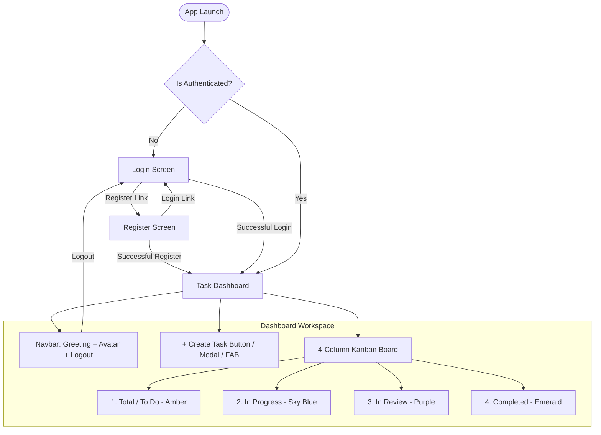

# 🚀 To-Do App (`to_do_app`) — Kanban & Task Management Mobile App

> A sleek, high-performance mobile Task Management & Kanban application built with **React Native (Expo)**, powered by **Zustand**, **React Hook Form + Zod**, **Expo Router File-Based Routing**, **Bun**, and **Docker**.

---

## 📑 Table of Contents
- [1. Executive Summary & Core Flow](#1-executive-summary--core-flow)
- [2. Tech Stack & Architectural Decisions](#2-tech-stack--architectural-decisions)
- [3. Application Flow & Screen Specifications](#3-application-flow--screen-specifications)
  - [3.1 Authentication Flow (Login & Register)](#31-authentication-flow-login--register)
  - [3.2 Dashboard & Navigation Bar](#32-dashboard--navigation-bar)
  - [3.3 4-Partition Kanban Board with Quick & Haptic Controls](#33-4-partition-kanban-board-with-quick--haptic-controls)
  - [3.4 Task Creation, Editing & Deletion](#34-task-creation-editing--deletion)
- [4. Project Structure (File-Based Routing)](#4-project-structure-file-based-routing)
- [5. Data Models & Zod Schemas](#5-data-models--zod-schemas)
- [6. State Management (Zustand Stores)](#6-state-management-zustand-stores)
- [7. UI/UX Design System](#7-uiux-design-system)
- [8. Bun & Docker Setup](#8-bun--docker-setup)
- [9. Execution & Run Guide](#9-execution--run-guide)

---

## 1. Executive Summary & Core Flow



---

## 2. Tech Stack & Architectural Decisions

| Layer / Concern | Technology | Role & Justification |
| :--- | :--- | :--- |
| **Runtime & Bundler** | **React Native (Expo SDK 51+)** | Cross-platform mobile runtime with fast refresh and native performance. |
| **Package Manager** | **Bun** | Ultra-fast JS/TS package management and script execution. |
| **Containerization** | **Docker & Docker Compose** | Reproducible dev environment and Expo dev server container. |
| **Routing** | **File-Based Routing (Expo Router)** | Declarative, URL-driven file-based routing (`app/` directory). |
| **State Management** | **Zustand** | Minimalist state with AsyncStorage persistence. |
| **UI Components** | **Custom Mobile Design Primitives** | Dark glassmorphism, responsive cards, buttons, badges, modals. |
| **Forms & Validation** | **React Hook Form + Zod** | Type-safe form handling with schema validation. |
| **Gestures & Haptics** | **Expo Haptics + Gesture Handler** | Haptic vibration feedback on long-press, selection, and actions. |
| **Icons** | **@expo/vector-icons & Lucide** | Minimalist vector icons for mobile and web. |

---

## 3. Application Flow & Screen Specifications

### 3.1 Authentication Flow (Login & Register)
* **Default Entry**: Unauthenticated users are routed to `/login`.
* **Login Screen (`/login`)**:
  * Username: Min 3 characters, alphanumeric.
  * Password: Secure text entry with toggle eye icon.
  * Form validation with Zod (`loginSchema`).
  * Sign In button with loading indicator.
* **Register Screen (`/register`)**:
  * Username: Alphanumeric username.
  * Email ID: Valid email check.
  * Password: Min 8 chars, 1 uppercase, 1 number.
  * Confirm Password: Must match password.
  * Validates and logs in immediately on success.

### 3.2 Dashboard & Navigation Bar
Located at the top of `/dashboard`:
* **Greeting & Identity**: `"Welcome back, {username}!"` with active tasks pending counter.
* **Profile Round Avatar**: Circular avatar with user initials / image and online status indicator.
* **Quick Add**: `+ New` button directly in the navbar.
* **Logout Button**: Outlined button with confirmation alert before clearing session.

### 3.3 4-Partition Kanban Board
The board features 4 distinct partitions:
1. **Total / To Do** (`todo`): Amber accent (`#F59E0B`), count badge.
2. **In Progress** (`in_progress`): Cyan / Sky Blue accent (`#0EA5E9`), count badge.
3. **In Review** (`in_review`): Deep Violet accent (`#A855F7`), count badge.
4. **Completed** (`completed`): Emerald accent (`#10B981`), count badge, strike-through task styling.

#### Interactive Controls:
* **One-tap column shifts**: Quick ⬅ and ➡ arrows on each card for rapid column movement.
* **Long-press or Menu (`...`)**: Opens a bottom action sheet allowing direct transfer to any column, edit, or delete.
* **Haptics**: Subtle vibrations triggered on press, column shifts, and task creation.
* **Search & Filters**: Real-time search bar + priority filter chips (`All`, `Urgent`, `High`, `Medium`, `Low`).
* **Progress Pill**: Displays current completed / total ratio and percentage.

### 3.4 Task Creation, Editing & Deletion
* **Create Task Dialog**: Accessible via FAB (`+`) or top-right buttons:
  * Title (required)
  * Description (optional)
  * Priority selector (Low, Medium, High, Urgent with color indicators)
  * Target Column selector
  * Due Date input
  * Tags / Categories (preset chips + custom tag adder)
* **Edit Task**: Tap any card or choose Edit in the menu to update all fields.
* **Delete Task**: Red delete action accompanied by confirmation alert.

---

## 4. Project Structure (File-Based Routing)

```text
to_do_app/
├── app/                           # File-based routing entry point
│   ├── _layout.tsx                # Root layout (SafeAreaProvider, Theme, Stack)
│   ├── index.tsx                  # Auth guard redirect (redirects to /login or /dashboard)
│   ├── (auth)/                    # Authentication Route Group
│   │   ├── _layout.tsx            # Auth layout
│   │   ├── login.tsx              # Login screen
│   │   └── register.tsx           # Register screen
│   └── (dashboard)/               # Protected Dashboard Route Group
│       ├── _layout.tsx            # Protected layout guard
│       └── index.tsx              # Main Kanban Dashboard
├── components/
│   ├── ui/                        # Mobile Design System Primitives
│   │   ├── button.tsx             # Primary, Secondary, Outline, Destructive
│   │   ├── input.tsx              # FormInput with icons & password toggle
│   │   ├── card.tsx               # Card, CardHeader, CardContent, CardFooter
│   │   ├── avatar.tsx             # Circular avatar with status indicator
│   │   ├── badge.tsx              # PriorityBadge, StatusBadge, TagBadge
│   │   ├── dialog.tsx             # Modal dialog container
│   │   └── dropdown-menu.tsx      # Task action bottom sheet
│   ├── kanban/                    # Kanban Board components
│   │   ├── board.tsx              # 4-partition horizontal board with search & filters
│   │   ├── column.tsx             # Single partition container
│   │   ├── task-card.tsx          # Interactive card with haptics & actions
│   │   └── create-task-dialog.tsx # Create & Edit task modal with Zod validation
│   └── layout/
│       └── navbar.tsx             # Top bar (Greeting, Avatar, Pending Count, Logout)
├── stores/
│   ├── use-auth-store.ts          # Zustand auth store (Persisted)
│   └── use-task-store.ts          # Zustand task & Kanban store (Persisted)
├── schemas/
│   ├── auth.schema.ts             # Zod validation for Login/Register
│   └── task.schema.ts             # Zod validation for Task models
├── types/
│   └── index.ts                   # TypeScript interfaces
├── Dockerfile                     # Docker container definition (Bun)
├── docker-compose.yml             # Docker compose configuration
├── package.json                   # Dependencies and scripts (Bun)
└── tsconfig.json                  # TypeScript compiler options
```

---

## 5. Execution & Run Guide

### Running with Bun Locally
```bash
cd to_do_app

# Start the Expo Metro bundler
bun run start

# Run on Web (Browser preview)
bun run web

# Run on Android emulator / device
bun run android

# Run on iOS simulator (macOS)
bun run ios
```

### Running with Docker
```bash
cd to_do_app

# Build and start container
docker-compose up --build

# Run in background
docker-compose up -d
```
